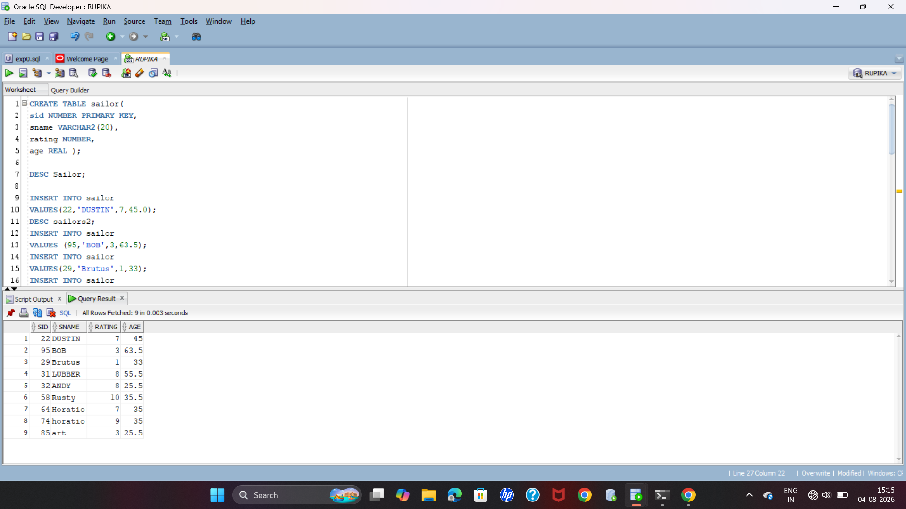

# EXPERIMENT-2
## Saiors table created
```
CREATE TABLE sailor(
sid NUMBER PRIMARY KEY,
sname VARCHAR2(20),
rating NUMBER,
age REAL );
```
## sailor table described
```
DESC Sailor;
```
## insert values in sailor table
```
INSERT INTO sailor
VALUES(22,'DUSTIN',7,45.0);
DESC sailors2;
INSERT INTO sailor
VALUES (95,'BOB',3,63.5);
INSERT INTO sailor
VALUES(29,'Brutus',1,33);
INSERT INTO sailor
VALUES(31,'LUBBER',8,55.50);
INSERT INTO sailor
VALUES(32,'ANDY',8,25.5);
INSERT INTO sailor
VALUES(58,'Rusty',10,35.5);
INSERT INTO sailor
VALUES(74,'horatio',9,35);
INSERT INTO sailor
VALUES(85,'art',3,25.5);
```
## Display sailors table
```
SELECT * FROM sailor;
SELECT * FROM sailor;
```
## commit the sailors table
```
COMMIT;
```
## Boats table created
```
CREATE TABLE boats(
bid NUMBER PRIMARY KEY,
bname VARCHAR2(20),
color VARCHAR2(10));
```
## describe boats table
```
DESC boats;
```
## reserves table created
```
CREATE TABLE reserves(
sid NUMBER,
bid NUMBER,
day DATE,
PRIMARY KEY(sid,bid,day),
FOREIGN KEY(sid)REFERENCES sailors(sid),
FOREIGN KEY(bid)REFERENCES boats(bid));
```
## Describe reserves table
```
DESC reserves;

```
### Screen shots


